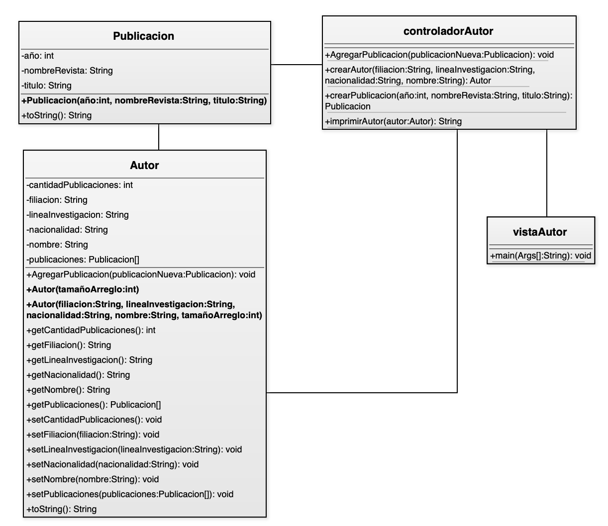

# Practica Calificada 3

Usando el Modelo Vista Controlador desarrollar un sistema de publicacionesteniendo como base el siguiente diagrama de clases y su documentacion  




## Pregunta 1: Crear la clase `Publicacion` 5 puntos

Crear la clase segun el diagrama de clases y segun las siguientes indicaciones:

- `Metodo toString`: Este método retornará todos los atributos de la publicación.

`Presentacion: Para obtener el puntaje completo necesita:`
- Usar modelo vista controlador para su desarrollo
- Subir a UTP CLASS + imagenes del codigo completo de la clase publicación
- Subir codigo a GitHub con un commit independiente por cada pregunta describiendo en el mensaje su nombre completo y la pregunta realizada
- Si no cumple con lo anterior no obtendra la puntuacion completa


## Pregunta 2: Crear la clase `Autor` 5 puntos

Crear la clase segun el diagrama de clases y segun las siguientes indicaciones:

- `Atributo TamañoArreglo`: Representa el número máximo de publicaciones que el arreglo puede contener.
- `Metodo setCantidadPublicaciones`: Valida que el valor asignado no exceda el tamaño del arreglo de publicaciones y propaga un error si es así.
- `Metodo AgregarPublicacion`: Valida que no se exceda el máximo de publicaciones permitido por el arreglo y propaga un error si se intenta superar este límite.
- `Metodo toString`: Retorna el nombre del autor junto con sus publicaciones en el siguiente formato:
  ```
  Autor: Carlos Publicaciones:  publicacion1.toString()
                                publicacion2.toString()
                                publicacion3.toString()
  ```
- `Constructor` Inicializa `CantidadPublicaciones` en cero.

`Presentacion: Para obtener el puntaje completo necesita:`
- Usar modelo vista controlador para su desarrollo
- Subir a UTP CLASS + imagenes del codigo completo de la clase publicación
- Subir codigo a GitHub con un commit independiente por cada pregunta describiendo en el mensaje su nombre completo y la pregunta realizada
- Si no cumple con lo anterior no obtendra la puntuacion completa

## Pregunta 3: Crear la clase `ControladorAutor` 5 puntos

- `Metodo AgregarPublicacion`: Llama al método `AgregarPublicacion` de la clase `Autor` y propaga cualquier error a la vista.
- `Metodo ImprimirAutor`: Utiliza el método `toString` del `Autor` para imprimir los detalles del mismo.

`Presentacion: Para obtener el puntaje completo necesita:`
- Usar modelo vista controlador para su desarrollo
- Subir a UTP CLASS + imagenes del codigo completo de la clase publicación
- Subir codigo a GitHub con un commit independiente por cada pregunta describiendo en el mensaje su nombre completo y la pregunta realizada
- Si no cumple con lo anterior no obtendra la puntuacion completa

## Pregunta 4: Crear la clase `VistaAutor` 5 puntos

- Crear dos autores, cada uno con tres publicaciones.
- Imprimir los autores con sus respectivas publicaciones utilizando los métodos definidos en las otras clases.
- No se requiere un menú para esta implementación; el código puede escribirse directamente en el método `main`. Uno de los autores a crear debe ser usted mismo, utilizando sus datos personales.

`Presentacion: Para obtener el puntaje completo necesita:`
- Usar modelo vista controlador para su desarrollo
- Subir a UTP CLASS + imagenes del codigo completo de la clase publicación
- Subir a UTP CLASS + imagenes de la ejecucion completa
- Subir codigo a GitHub con un commit independiente por cada pregunta describiendo en el mensaje su nombre completo y la pregunta realizada
- Si no cumple con lo anterior no obtendra la puntuacion completa
